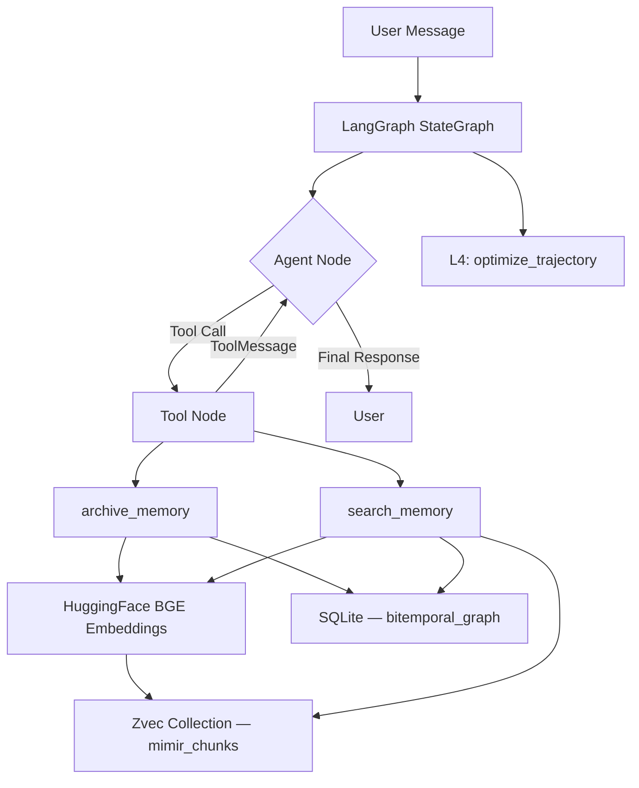
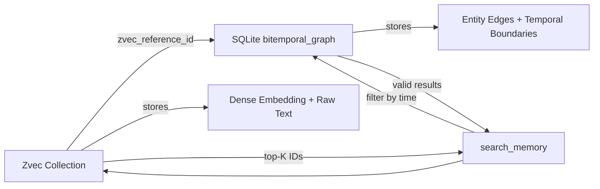

# Mimir — Project Prospectus

> A zero-server, in-process agentic memory system for Apple Silicon.

---

## 1. Executive Summary

Mimir is a locally-hosted, zero-dependency-infrastructure memory system for LLM-powered agents. It unifies **dense vector search**, **bitemporal knowledge graphs**, and **autonomous tool-calling** into a single Python process — no Docker, no cloud databases, no external servers.

Mimir draws its design from four established paradigms:

| Paradigm | Inspired By | What Mimir Takes |
|----------|-------------|------------------|
| Autonomous context management | Letta (MemGPT) | Agent self-manages memory via tools |
| Strict entity routing | Mem0 | Scoped memory with user/session/system tags |
| Bitemporal knowledge graphs | Zep (Graphiti) | Facts have `valid_from` / `valid_to` timestamps — nothing is ever deleted |
| Procedural learning | LangMem | Post-session trajectory optimization stub |

The result is a system that runs entirely on a MacBook, stores everything to disk, and gives an LLM agent the ability to **remember, forget, and reason about time** — all without a single network hop to a database.

---

## 2. Architecture



### Layer Breakdown

| Layer | Name | Role |
|-------|------|------|
| **L1** | OS Context Manager | Manages raw context flow between user and agent |
| **L2** | Semantic Router | Routes queries to `archive_memory` or `search_memory` tools based on intent |
| **L3** | Bitemporal Knowledge Engine | Dual storage — Zvec for dense vectors, SQLite for temporal graph edges |
| **L4** | Procedural Optimizer | Post-session async stub that extracts behavioral rules from conversation history |

### Bitemporal Model

Traditional memory systems overwrite old facts. Mimir **never deletes**. When a fact changes, the old record's `valid_to` is set to `CURRENT_TIMESTAMP`, and a new record is inserted with `valid_to = NULL` (currently active).

```
Before: user --(lives_in)--> Chennai  | valid_from: T1, valid_to: NULL
After:  user --(lives_in)--> Chennai  | valid_from: T1, valid_to: T2   ← capped
        user --(lives_in)--> London   | valid_from: T2, valid_to: NULL ← new
        user --(lived_in)--> Chennai  | valid_from: T2, valid_to: NULL ← historical
```

This means `search_memory` can answer both **"Where does John live?"** and **"Where did John live on January 5th?"** from the same dataset.

---

## 3. Technology Stack

| Component | Technology | Why |
|-----------|-----------|-----|
| **Vector Storage** | Zvec v0.2.0 (Alibaba Proxima) | In-process C-extension, no server, millisecond search on billions of vectors |
| **Graph/Relational** | `sqlite3` (Python stdlib) | Zero-install, ACID-compliant, file-based, battle-tested |
| **Embeddings** | `BAAI/bge-small-en-v1.5` via HuggingFace | 384-dim, fast on CPU, normalized embeddings, runs locally on Apple Silicon |
| **Agent Framework** | LangGraph + LangChain Core | Compile-time graph with conditional routing between agent and tool nodes |
| **LLM** | Any OpenAI-compatible endpoint | Tested with `gpt-4o-mini` via OSM API; swappable for Ollama/vLLM for fully offline use |
| **Runtime** | Python 3.12 | Required for Zvec binary compatibility |

---

## 4. Dependencies

### Core (Required)
```
zvec==0.2.0
langchain-core>=1.2.0
langgraph>=1.0.0
langchain-huggingface>=1.2.0
sentence-transformers>=5.0.0
langchain-openai>=1.0.0
```

### Stdlib (No Install)
```
sqlite3
asyncio
os, datetime, json
```

### Development
```
pyenv          — manages Python 3.12 alongside system Python
```

---

## 5. Competitive Analysis

### Mimir vs. the Top 4 Alternatives

| Dimension | **Mimir** | **Letta (MemGPT)** | **Mem0** | **Zep** | **LangMem** |
|-----------|-----------|---------------------|----------|---------|-------------|
| **Infrastructure** | Zero. Single process, file-based. | Server (ADE) + database required | Cloud SaaS or self-hosted with Redis/Qdrant | Neo4j or hosted Graphiti backend | LangGraph memory store |
| **Temporal Reasoning** | ✅ Native bitemporal `valid_from`/`valid_to` on every edge | ❌ No temporal model | ❌ Overwrites or appends; no temporal query | ✅ Graphiti temporal KG (requires Neo4j) | ❌ No temporal model |
| **Vector Backend** | Zvec (in-process C-extension, zero-server) | External vector DB (Chroma, Pinecone, etc.) | Qdrant, Pinecone, or custom | Embedded in Graphiti | LangGraph BaseStore |
| **Privacy / Offline** | ✅ Fully local (embeddings + storage) | Partial (needs LLM API) | ❌ Cloud-first design | ❌ Requires Neo4j | Partial |
| **Setup Complexity** | `pip install` + single file | Docker + server config + ADE | API key + cloud config | Neo4j + Graphiti setup | LangGraph ecosystem |
| **Latency** | Sub-millisecond (in-process) | Network hops to vector DB | ~200ms p95 (cloud) | ~100ms (precomputed) | ~60s p95 (multi-hop) |
| **Apple Silicon Optimized** | ✅ Native ARM binary (Zvec) | ❌ Not specifically | ❌ Cloud-hosted | ❌ Not specifically | ❌ Not specifically |
| **Cost** | $0 infrastructure | Server hosting costs | SaaS subscription or self-host | Neo4j license + hosting | Free (LangChain ecosystem) |

### Why Mimir Wins for Edge / Local AI

1. **Zero Ops.** No Docker, no database servers, no cloud keys. Install, run, done. Mimir stores everything in `./mimir_data` — SQLite files and Zvec binary collections on disk.

2. **True Bitemporality without Neo4j.** Zep's Graphiti is the only competitor with temporal reasoning, but it requires a full Neo4j graph database. Mimir achieves the same `valid_from`/`valid_to` semantics using vanilla SQLite — a 700KB stdlib module.

3. **In-Process Vector Search.** Every other system requires a network hop to Chroma, Pinecone, Qdrant, or Milvus. Mimir's Zvec runs as a C-extension *inside* the Python process, eliminating serialization overhead entirely.

4. **Privacy by Default.** Embeddings are generated locally via HuggingFace BGE. The only external call is to the LLM endpoint — and even that can be replaced with a local Ollama instance for fully air-gapped operation.

5. **Portable.** The entire memory state is a directory. Copy `./mimir_data` to another machine and the agent resumes exactly where it left off — including full temporal history.

---

## 6. Deep Dive: How Mimir Uses Zvec

### What is Zvec?

Zvec is an open-source, in-process vector database developed by **Alibaba's Tongyi Lab**, built on top of **Proxima** — the same vector search engine that powers Taobao, Alipay, and Youku in production. It is designed to be the "SQLite of vector databases": a single library that embeds directly into your application process with no server, no daemon, no network calls.

### Why Zvec Over Alternatives?

| Vector DB | Architecture | Latency | Setup |
|-----------|-------------|---------|-------|
| **Zvec** | In-process C-extension | Sub-ms | `pip install zvec` |
| Chroma | Client-server | ~10ms | Docker or hosted |
| Qdrant | Client-server | ~5ms | Docker or cloud |
| Pinecone | Cloud SaaS | ~50ms | API key + cloud |
| FAISS | In-process (Meta) | Sub-ms | No persistence, no schema |

Zvec uniquely combines FAISS-level performance with Chroma-level features (persistence, schema, CRUD) without requiring any server infrastructure.

### Mimir's Zvec Integration (v0.2.0)

#### Schema Definition

Mimir defines a collection called `mimir_chunks` with three fields:

```python
schema = zvec.CollectionSchema(
    name="mimir_chunks",
    fields=[
        zvec.FieldSchema(name="id", data_type=zvec.DataType.STRING),
        zvec.FieldSchema(name="text", data_type=zvec.DataType.STRING)
    ],
    vectors=[
        zvec.VectorSchema(
            name="embedding",
            data_type=zvec.DataType.VECTOR_FP32,
            dimension=384  # BGE-small output dim
        )
    ]
)
collection = zvec.create_and_open(path="./mimir_data/zvec_data/mimir_chunks", schema=schema)
```

- **`id`** — A timestamp-based unique identifier (`chunk_20260224162706123456`)
- **`text`** — The raw natural language content being stored
- **`embedding`** — A 384-dimensional FP32 dense vector from `BAAI/bge-small-en-v1.5`

#### Document Insertion

When the LLM calls `archive_memory`, Mimir:

1. Generates an embedding via `HuggingFaceEmbeddings.embed_query(content)`
2. Constructs a `zvec.Doc` with vectors and scalar fields separated per the v0.2.0 API:

```python
doc = zvec.Doc(
    id=zvec_id,
    vectors={"embedding": embedding},  # dict mapping field name -> vector list
    fields={"text": content}            # dict mapping field name -> scalar value
)
collection.insert([doc])
```

3. Simultaneously writes a bitemporal edge to SQLite linking `zvec_reference_id` back to this document

#### Semantic Search

When the LLM calls `search_memory`, Mimir:

1. Embeds the query string
2. Executes a `VectorQuery` against the Zvec collection:

```python
results = collection.query(
    vectors=zvec.VectorQuery(field_name="embedding", vector=query_embedding),
    topk=5
)
zvec_ids = [doc.id for doc in results]
```

3. Cross-references these IDs against SQLite to filter for temporal validity:

```sql
SELECT source_entity, relationship, target_entity, valid_from, valid_to
FROM bitemporal_graph
WHERE zvec_reference_id IN (?, ?, ?, ?, ?)
  AND valid_to IS NULL  -- currently active facts only
```

This two-phase approach (semantic similarity → temporal filtering) ensures that Mimir returns only facts that are **both semantically relevant and temporally valid**.

#### The Zvec ↔ SQLite Bridge

Every document in Zvec has a corresponding row in SQLite via `zvec_reference_id`. This is the architectural bridge that makes bitemporal vector search possible:



#### API Discovery Notes

The Zvec v0.2.0 C-extension's actual API diverged significantly from public documentation. During integration, we resolved every mismatch through live introspection:

| What Docs Say | What v0.2.0 Actually Uses |
|---------------|--------------------------|
| `zvec.Client(path=...)` | `zvec.create_and_open(path=..., schema=...)` |
| `FieldSchema(dtype=...)` | `FieldSchema(data_type=...)` |
| `VectorSchema(dim=...)` | `VectorSchema(dimension=...)` |
| `DataType.VARCHAR` | `DataType.STRING` |
| `collection.search(vectors=[...])` | `collection.query(vectors=VectorQuery(...))` |
| `Doc(embedding=..., text=...)` | `Doc(vectors={...}, fields={...})` |

These findings were obtained by running `dir(zvec)`, `help(zvec.FieldSchema.__init__)`, and similar introspection calls directly against the installed binary in the `.venv12` environment.

---

## 7. Future Roadmap

- **L4 Activation**: Replace the `optimize_trajectory` stub with a real LLM call that extracts behavioral rules and appends them to the system prompt
- **Multi-agent Shared Memory**: Multiple LangGraph agents reading/writing to the same Zvec + SQLite backend
- **Sparse Vector Support**: Zvec natively supports `SPARSE_VECTOR_FP32` — enabling hybrid dense+sparse retrieval
- **Conflict Resolution**: When two agents archive conflicting facts simultaneously, implement a merge strategy in the bitemporal layer
- **Ollama Integration**: Swap `ChatOpenAI` for a local Ollama endpoint for fully air-gapped, zero-network operation
